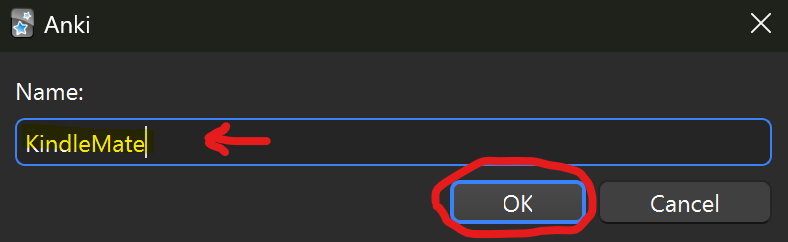

## Follow this guide to create yourself an Anki Card!

This guide will lead you into having a perfect anki card for all the cards that you may export from your kindle.
To begin, launch Anki on your desktop and do as follows

1. Manage Note Types (`Tools > Manage Note Types (Ctrl+Shift+N)`)


2. Adding a new note type


3. Select Basic and add it Make sure that you only select the basic type


4. Name it whatever you like and remember it for the next step.



5. Select your note type from the manage notes screen, make sure you select the note type with the name you selected in the step before. Then press `Cards`


6. You will see the following screen, here make sure you have selected `Front Template` and then replace it with the following code (Just copy paste it!)

```html
<span id="front">{{Front}}</span>
```


7. Now, select the `Back Template` and replace it with the following code

```html
<span id="front">{{FrontSide}}</span>

<hr id=answer>

{{Back}}
```


8. Finally, select the `Style` tab and replace all of it with the following:

```css
.card {
    font-family: arial;
    font-size: 20px;
    text-align: center;
    color: black;
    background-color: white;
}

#front {
	font-size: 40px;
}

.readingscont {
	font-size: 30px;
}

.definecont {
	border: 1px solid;
	padding: 0.5em;
	border-radius: 0.5em;
	margin-left: 0.5em;
}

.tags {
	font-style: italic;
	font-size: 15px;
}

.definelabel {
	display: block;
	padding-top: 1em;
}

.definepartspeech {
	font-style: italic;
	margin-bottom: 1em;
}

.definerelated, .defineantonym {
	margin-top: 1em;
	display: flex;
	align-items: center;
	gap: 0.3em;
}

.defineknji {
	display: inline-flex;
	flex-direction: column;
	align-items: center;
}

.knji {
	font-size: 25px;
}
.furigana {
	font-size: 15px;
}


ol > li {
	margin-bottom: 0.5em;
}
```


9. Press `Save`


And that's all, now you can close all the windows and your note type is ready, head over back to the main page of this repository to learn how to import cards to anki from kindle's vocabulary builder.

