# KindleMateAnki-JP-EN-Dictionary
A KindleMateAnki dictionary for japanese and english both.

## Screenshots of Cards

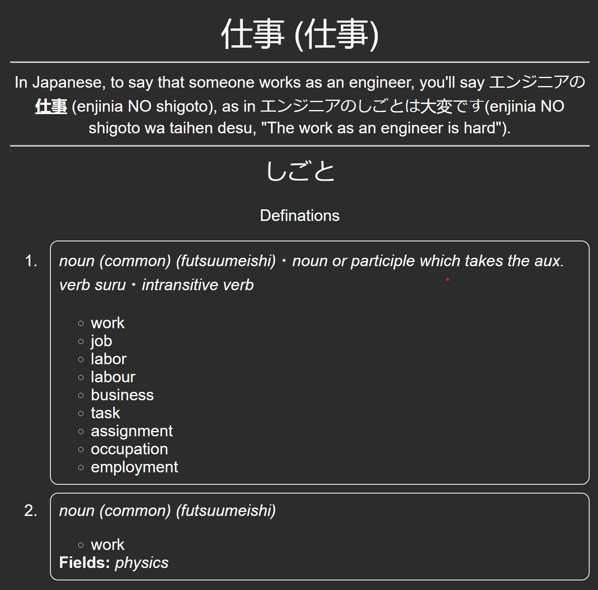
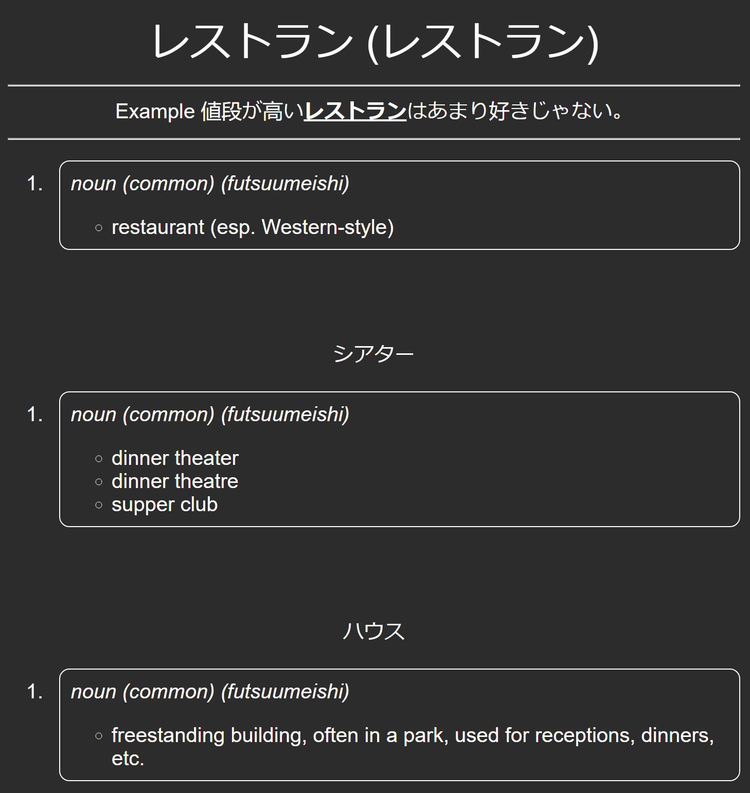

## User Guide / Tutorial

First head over to [releases](https://github.com/amaank404/KindleMateAnki-JP-EN-Dictionary/releases/latest) and from there download the latest `japanese-dict.txt`. From there, copy the downloaded dictionary file to `C:\Users\USERNAME\Documents\Kindle Mate\dicts` (Change USERNAME to your username)

Then do the following steps as described

1. Open KindleMate with your kindle connected and import all your kindle vocabulary builder vocab

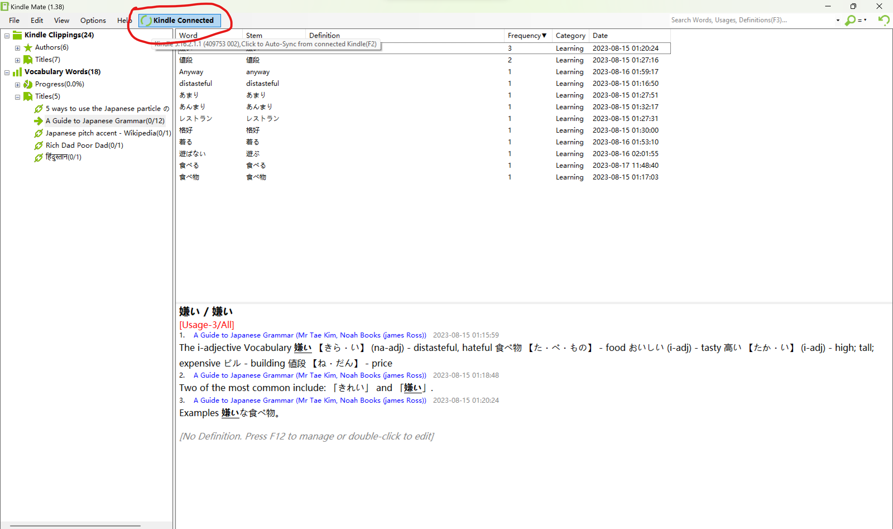

2. Press `F12` or `Fn+F12` key depending on your keyboard to open dictionary menu, you can also open dictionary menu using the following

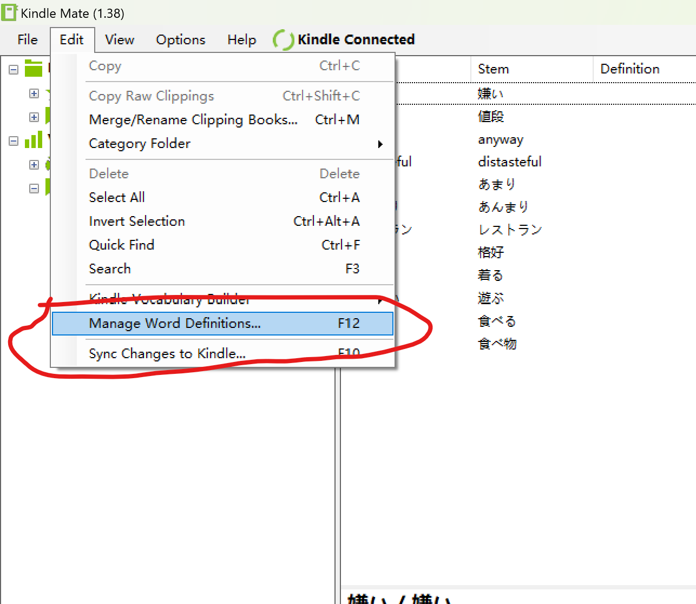

3. Make sure you configure as follows, Change the dictionary, encoding, and make sure to tick `Ignore words with definition`. Then, choose what words you want to have the definations for, I recommend you choose vocabulary words since this will help you to fill out all unfilled definitions. Once that's done, press start and all the definitions will be filled with html. This itself is not readable within kindle mate. The HTML exists solely for anki cards.

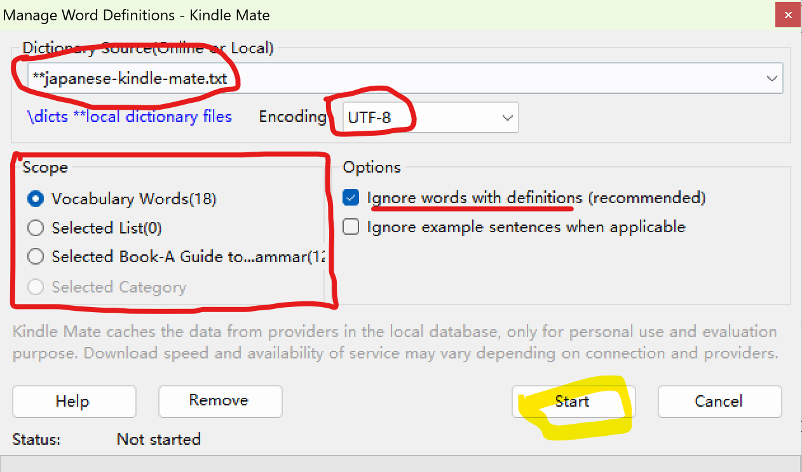

4. Export your vocabulary words either all of them or whatever you have selected

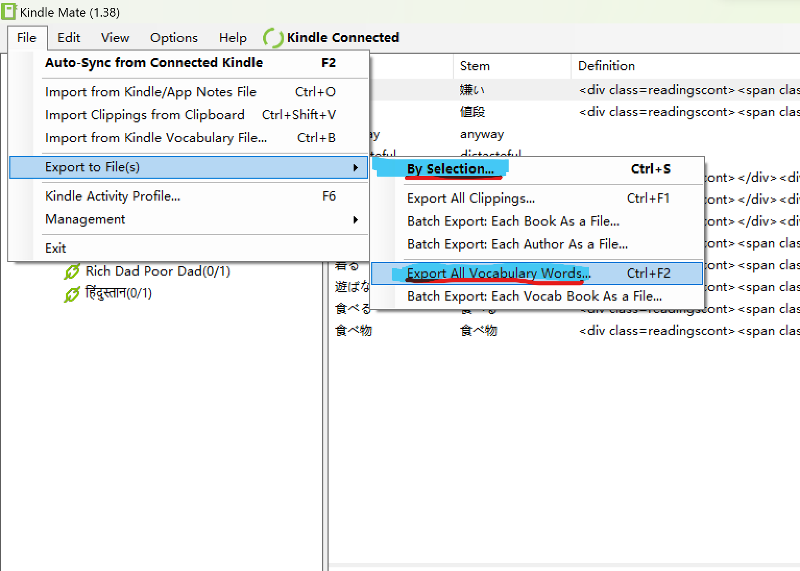

5. Select the file type as `Anki (Tab separated, UTF-8, HTML enabled)(*.txt)`

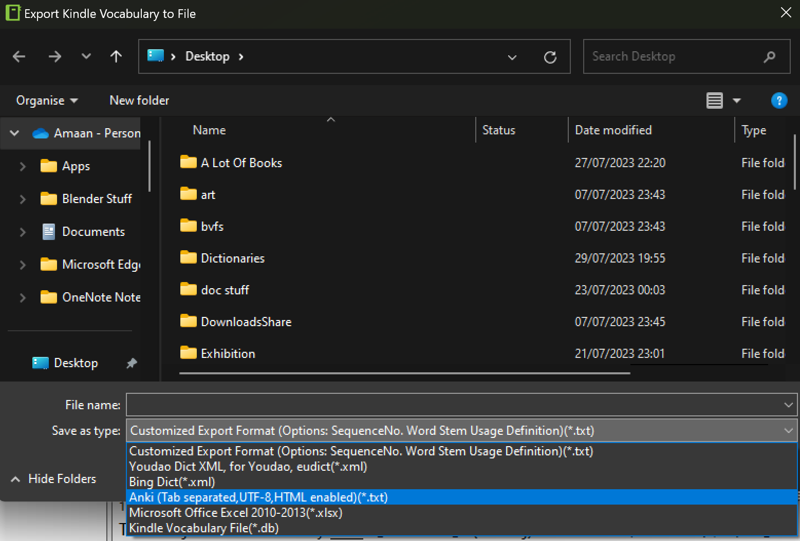

6. Enter your file name and hit save button, make sure you remember the filename and location whereever you are saving it.

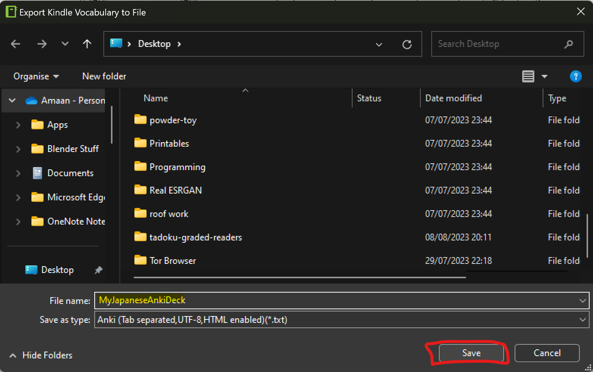

7. Head over to the following guide to setup your anki card and return back to this main page once that guide is done

[LINK TO GUIDE](CREATING_ANKI_CARD.md)

8. Once that's done, head over to Anki. Open it and create a new deck for all your current and future kindlemate card (You do not need to repeat this step when importing later on new cards, old card process isn't reset by anki on import)

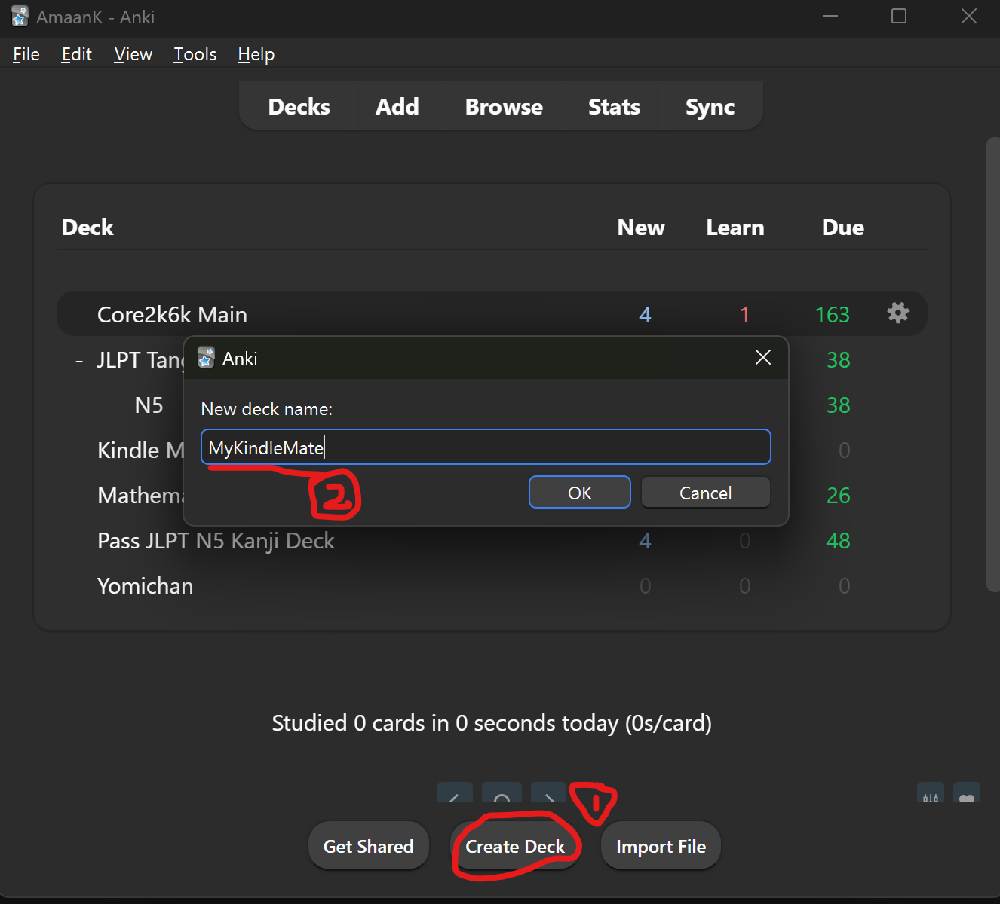

9. Now, Import the cards, using anki. Here point it to the location you specified earlier while exporting.

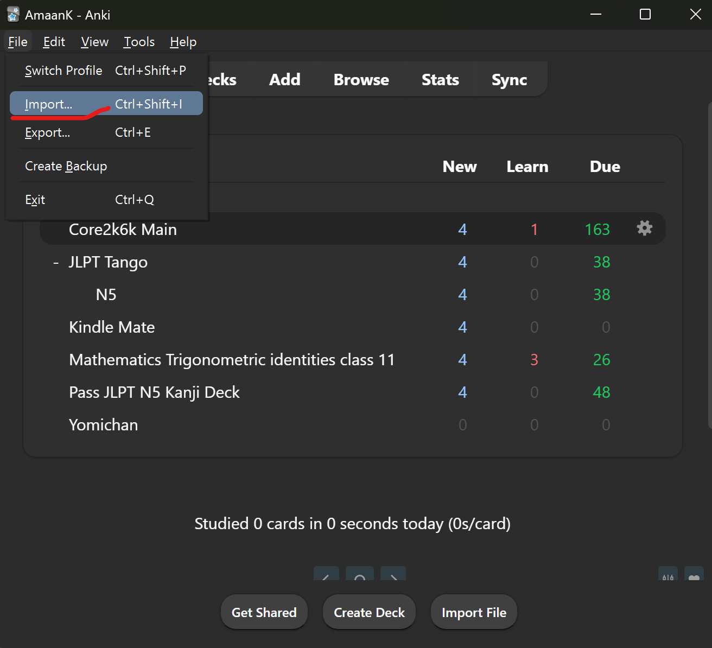
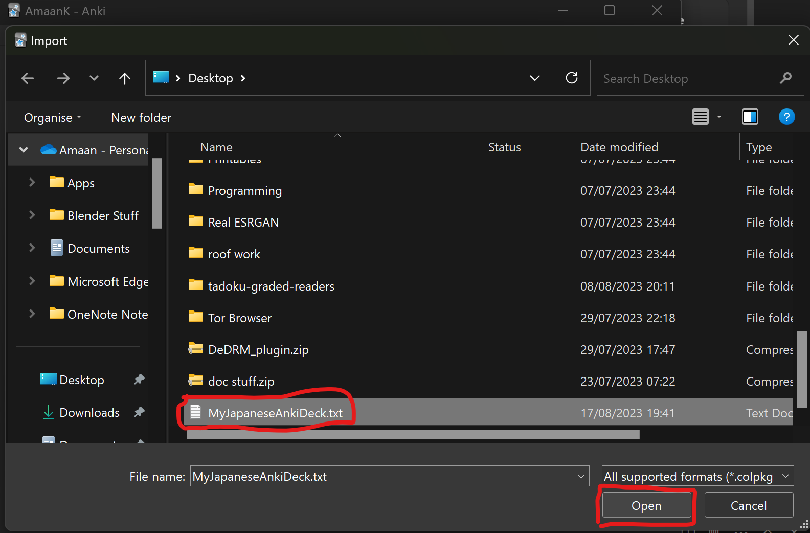

10. Configure the import settings as follows, Field separator should always be set to Tab, make sure that the word is set to front and the sentence+defination (the second field) is set to Back in the field mapping options. Always, and I am saying always, check and make sure you are importing into correct deck, importing into another deck is half irreversable so better be safe than sorry. **Always check these settings carefully before importing**. Once that's done, hit import and let Anki do the rest for you.

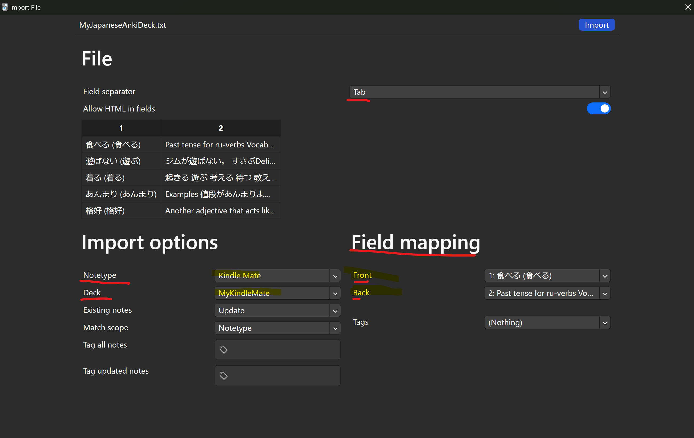

11. Now, you have got all you kindle words into anki with proper defination etc. Happy Learning!

## Generating the dictionary yourself

1. Install Python
2. Install requirements `pip install -r requirements.txt`
3. Run `python anki_jp_en_dictionary.py`
